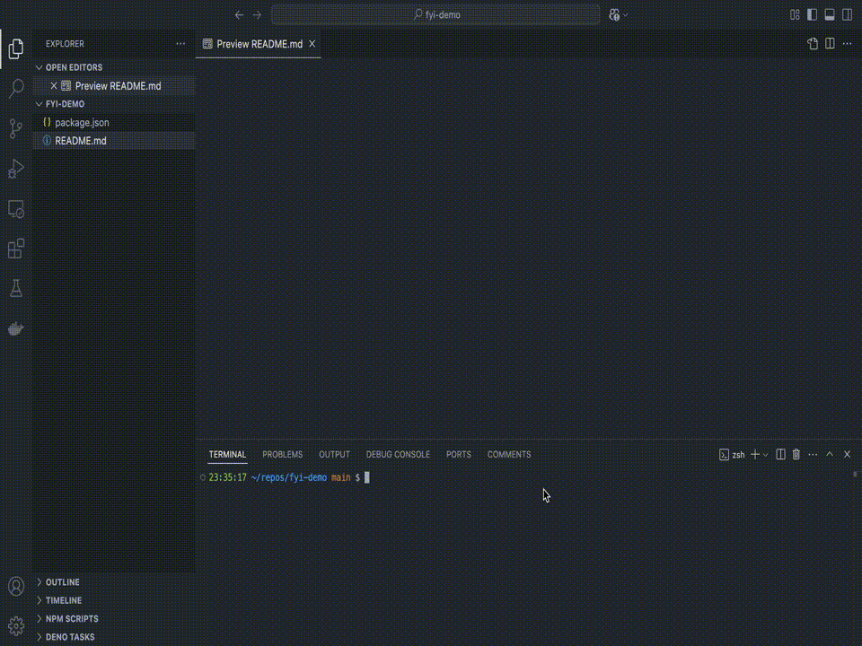

# FYI

> "Like phone apps that wait until you pick up your device to notify you"

+ Nobody reads READMEs
+ Motion attracts attention

## READMEs in motion

The `FYI` extension ensures important information gets noticed.

> When someone pulls a branch containing an updated markdown file,
> they will see a notification pop up in VS Code.

This pop-up includes a button that takes them directly to the relevant section of the README.

## How It Works
> README file -> notification -> README file

1. Draft an `FYI.md` file with the important information (See [syntax](#syntax) you already know).
2. Commit it to version control.
3. When someone pulls the branch in VS Code, they will see a notification.
4. Clicking the `Learn More` button takes them to the exact portion of the README you specified.

## Example


What is happening?
1. User is on a branch that does not have the `FYI.md` file
2. User fetched and now switches to the `main` branch
3. `main` has an `FYI.md` file and it contains 2 notification definitions
4. Because this is the 1st time user gets this version of the `FYI.md` file,
the scheduled notifications pop up
5. User clicks the `Learn More` button of the **modal**, the `markdown preview` page opens and the relevant content is displayed
6. User clicks the `Learn More` button of the **popup**, and the relevant content scrolls into view in the `markdown preview`

- `Got it` button: permanently dismiss the notification
- `Not now` button: dismiss the notification until next startup

## Features

+ **Attention-Grabbing Notifications**: Ensure critical information is seen.
+ **Direct Navigation**: Take users directly to the relevant section of the README.
+ **Easy Setup**: Simply create and commit an `FYI.md` file.
+ **Multi-roots** project support.
+ **Permanently dismissable notifications**: On a per-user basis. Control is in their hands.
+ **2 levels of urgency**: By default all notifications are a `non-intrusive pop-up`, but they can be configured to be an `unavoidable modal`.
+ Inherently **collaborative**.

### Commands
`shift` + `command` + `p`
+ `FYI: Generate markdown file`: Creates an `FYI.md` file at the root of your project
+ `FYI: Reset Dismissed Notifications`: Unsilence notifications that you permanently dismissed

## Requirements

Works with `git` projects and requires all users to have their git `user.email` configured.

```sh
# check if set:
git config --get user.email
# set globally (for all repositories):
git config --global user.email "you@example.com"
```

---

## Syntax

The `FYI.md` file **must** contain the following 2 headers:
1. `# FYI`
2. `# Details`

Anywhere in the file, but in that order.

Any `quote` found in between these 2 headers, will be used to generate a notification.

For a notification to contain a `Learn More` button that will take users to the portion of the file you wish them to see, **end** the quote with an `anchor`.

The anchor is simply the `#header` bit in a `[regular link](#header)`.

For a notification to show up as a `modal`, start the quote with `(!)`.  
Leverage this __judiciously__ and __sparingly__ for truly `crucial` information.

```markdown
# FYI

## Simple example
Without a 'Learn More' button

> Simple notification content

## Multiline example

> Multiline quotes still amount to
> a single notification

## Anchored example
Keep the notification content succinct  
elaborate in the `Details` section

> With a 'Learn More' button #anchored-example-1

## Crucial example

> (!) This is now a modal #crucial-example-1

# Details

## Anchored example
When users click the `Learn More` button, the __markdown preview__ page will open and take them right here.

Notice how the anchor ends in `-1`? This is standard markdown because this file contains 2 identical headers `## Anchored example`.

## Crucial example

> With great power comes great responsability.

This above quote will `not` turn into a notification, because it is `not` positioned between the `# FYI` and `# Details` headers.
```

In this example, you will find 4 quotes in between the opening and closing headers (`# FYI` and `# Details`).

This will amount to 4 different notifications being rendered in `vscode`. Of which 1 will be a modal.

> [!NOTE]
> At this time, markdown syntax used inside a notification definition quote
> will not be interpreted when the notification gets rendered.

> [!NOTE]
> Sometimes vscode can be funny with case-sensitivity in file names.
> If you've used the extensions's command to generate the FYI.md file, you will be fine.
> If you've manually created the file and lowercased it as fyi.md, surprises may ensue.
